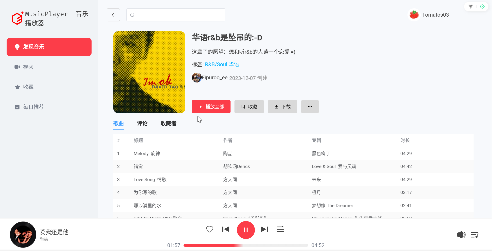
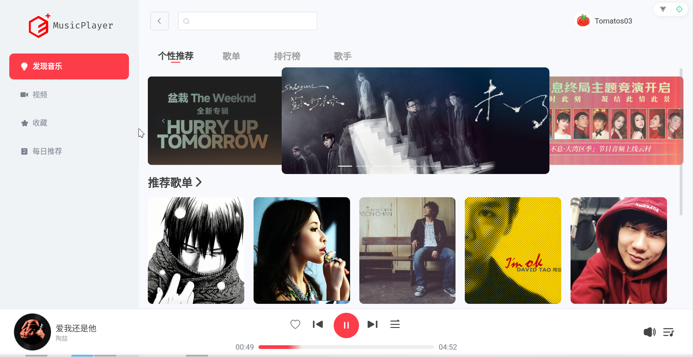
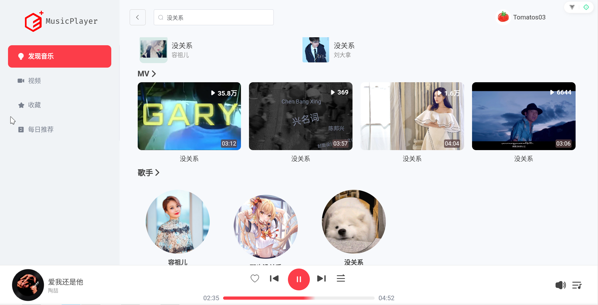
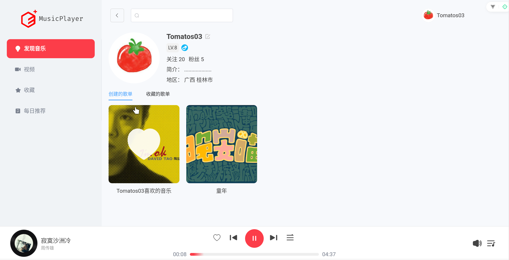

<div align="center">
  
  <h1 align="center">MusicPlayer</h1>
  <p>基于Vue3实现的仿网易云网页在线音乐播放器</p>
</div>


## 前言

知识总是在不断应用得以中巩固，为了巩固我所学的Vue相关知识，我尝试编写了这个网页音乐播放器项目。由于能力和精力有限，项目可能会存在一些小问题，如果发现了麻烦指出。

## 技术栈

- **前端框架**: [Vue 3](https://cn.vuejs.org/)
- **构建工具**: [Vite](https://vitejs.cn/vite3-cn/) 
- **状态管理**: [Vuex](https://vuex.vuejs.org/zh/guide/)
- **路由**: [Vue Router](https://router.vuejs.org/zh/guide/)
- **样式**: [SCSS](https://sass.nodejs.cn/) 
- **UI框架**: [Element UI](https://cn.element-plus.org/zh-CN/guide/design.html)

## 安装步骤

在开始如下步骤前，请确保已经安装并运行项目依赖后端程序[NeteaseCloudMusicApi](https://gitlab.com/Binaryify/neteasecloudmusicapi)

1. 克隆项目：

    ```bash
    git clone https://github.com/yourusername/MusicPlayer.git
    cd MusicPlayer
    ```

2. 安装依赖：

    ```bash
    npm install
    ```

3. 启动开发服务器：

    ```bash
    npm run dev
    ```

4. 打开浏览器访问 `http://localhost:3000`。


## 功能模块
- **个性化推荐**: 根据用户喜好推荐音乐。
- **音乐排行榜**: 显示热门音乐排行榜。
- **播放列表**: 用户可以创建和管理自己的播放列表。
- **每日推荐**: 每天为用户推荐新音乐。
- **用户登录**: 提供验证码登录和手机号登录


## 部分截图










## 项目布局

```
MusicPlayer/
├── public/                  # 静态资源
│   └── favicon.ico          # 网站图标
├── src/                     # 源代码
│   ├── assets/              # 资源文件（图片、样式等）
│   │   ├── css/             # CSS样式文件
│   │   │   ├── base.css      # 基础样式
│   │   │   ├── main.css      # 主要样式
│   │   │   └── modifyelementui.css # Element UI样式修改
│   │   ├── images/          # 图片资源
│   │   │   ├── disc-default.png # 默认唱片图片
│   │   │   ├── disc.png      # 唱片图片
│   │   │   └── needle.png    # 唱针图片
│   │   ├── json/            # JSON数据文件
│   │   │   └── province.json  # 省份数据
│   │   └── scss/            # SCSS样式文件
│   │       ├── configs.scss   # 配置样式
│   │       ├── functions.scss  # 函数样式
│   │       ├── index.scss      # 入口样式
│   │       ├── mixins.scss     # 混合样式
│   │       └── theme.scss      # 主题样式
│   ├── components/          # Vue组件
│   │   ├── AdaptiveContainer.vue # 自适应容器组件
│   │   ├── AlbumCard.vue     # 专辑卡片组件
│   │   ├── HeaderBar.vue      # 头部导航组件
│   │   ├── ListCard.vue       # 列表卡片组件
│   │   ├── MusicControler.vue  # 音乐控制组件
│   │   ├── MVCard.vue         # MV卡片组件
│   │   ├── NavBar.vue         # 导航栏组件
│   │   ├── SliderCard.vue      # 滑块卡片组件
│   │   ├── SongCard.vue        # 歌曲卡片组件
│   │   └── UserCard.vue        # 用户卡片组件
│   │   ├── Login/              # 登录组件
│   │   │   ├── Login.vue       # 登录主组件
│   │   │   ├── CaptchaLogin/   # 验证码登录组件
│   │   │   │   └── CaptchaLogin.vue # 验证码登录实现
│   │   │   └── OPTLogin/       # 一键登录组件
│   │   │       └── OPTLogin.vue # 一键登录实现
│   ├── network/              # 网络请求
│   │   └── request.js         # 网络请求封装
│   ├── router/               # 路由配置
│   │   └── index.js           # 路由定义
│   ├── store/                # 状态管理
│   │   └── index.js           # Vuex状态管理
│   ├── utils/                # 工具函数
│   │   └── utils.js           # 工具函数实现
│   ├── views/                # 视图组件
│   │   ├── Index.vue          # 首页视图
│   │   ├── AccountDetail/     # 账户详情视图
│   │   │   └── AccountDetail.vue # 账户详情实现
│   │   ├── Collect/           # 收藏视图
│   │   │   └── Collect.vue     # 收藏实现
│   │   ├── DailyRecommend/     # 每日推荐视图
│   │   │   └── DailyRecommend.vue # 每日推荐实现
│   │   ├── DiscoverMusic/      # 音乐发现视图
│   │   │   ├── DiscoverMusic.vue # 音乐发现实现
│   │   │   ├── MusicRank/      # 音乐排行榜视图
│   │   │   │   └── MusicRank.vue # 音乐排行榜实现
│   │   │   ├── PersonalityRecommend/ # 个性化推荐视图
│   │   │   │   └── PersonalityRecommend.vue # 个性化推荐实现
│   │   │   └── PlayList/       # 播放列表视图
│   │   │       └── PlayList.vue # 播放列表实现
│   │   ├── SearchResultDetail/  # 搜索结果详情视图
│   │   │   └── SearchResultDetail.vue # 搜索结果详情实现
│   │   └── Video/              # 视频视图
│   │       └── Video.vue       # 视频实现
│   ├── App.vue                # 主应用组件
│   └── main.js                # 入口文件
├── .editorconfig              # 编辑器配置
├── .gitignore                 # Git忽略文件
├── package.json               # 项目依赖和脚本
└── README.md                  # 项目说明文件
```

## 贡献指南

欢迎任何形式的贡献！请提交问题或拉取请求。
